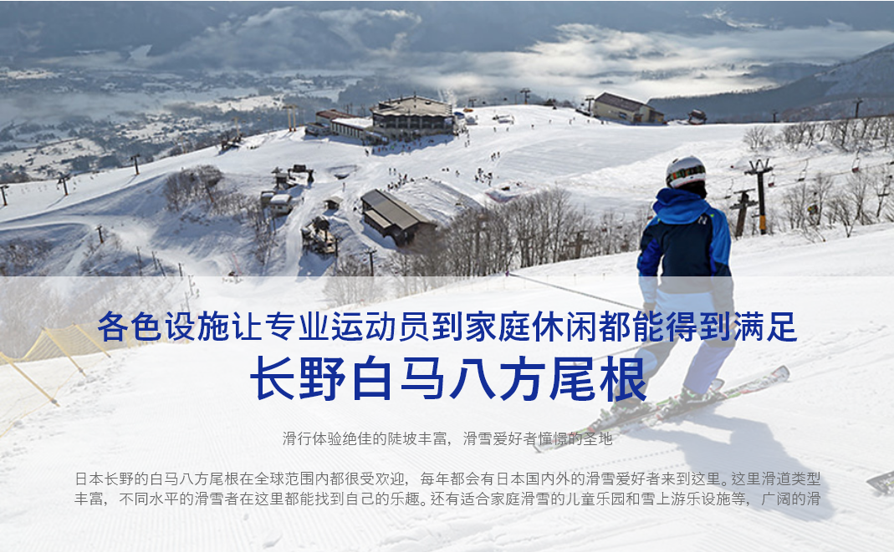
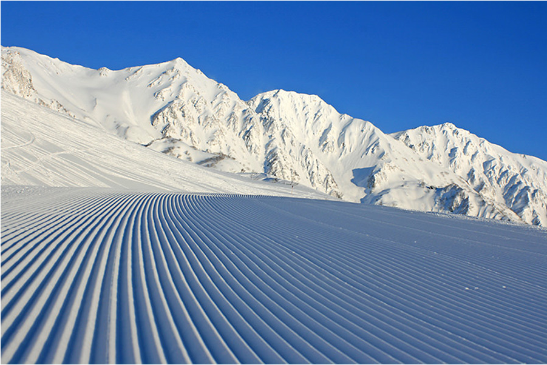
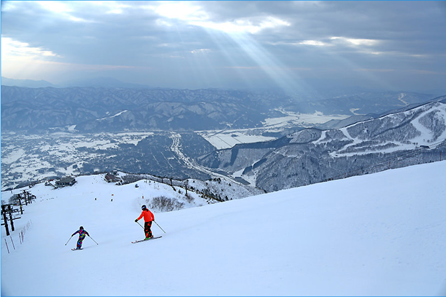

滑道状态一直保持高质量。通透的蓝天与闪着白色光芒的白马三山的对比很美

从山顶的最长滑行距离8000米的长距离滑道滑起来很爽

### 丰富的滑道和游乐设施适合不同水平的滑雪者

白马作为日本长野冬季奥运会的举办地，在全世界都有很高的知名度。作为日本最大规模的滑雪场，拥有一天滑不过来的丰富滑道，其中不乏超过1000米的长距离滑道。从山顶可以眺望白马三山和日本北阿尔卑斯。山顶与山脚的落差有1071米。能够在冬天美丽的自然风光中滑到爽歪歪。

这里著名滑道枚不胜举，有鱼鳞包密布的兔平滑雪场、作为冬奥会赛场的奥运会滑道、毎年草大会使用的大型回转竞速赛滑道等，从上一季起，在黑菱滑雪场开放了非压雪区域，可以体验蓬松细密的粉雪区。

咲花滑雪场的缓坡较多，适合家庭滑雪和初学者。还有仅用于此地区缆车的缆车券可选。可体验雪橇、雪上娱乐且能进行滑雪练习的儿童乐园“sunocchao（すのっちゃお）、雪上漂流等雪上娱乐项目丰富的北尾根高原的“雪上娱乐区”等，滑道和环境都能够支持不同水平的滑雪者。

分布在不同区域的9家餐厅既有高级的意大利菜，也有便宜的滑雪套餐等，可以根据所需选择。因海外游客的增加，滑雪场也增加了提供西式简餐的餐厅和咖啡厅。让人在滑雪和美食上都满意。